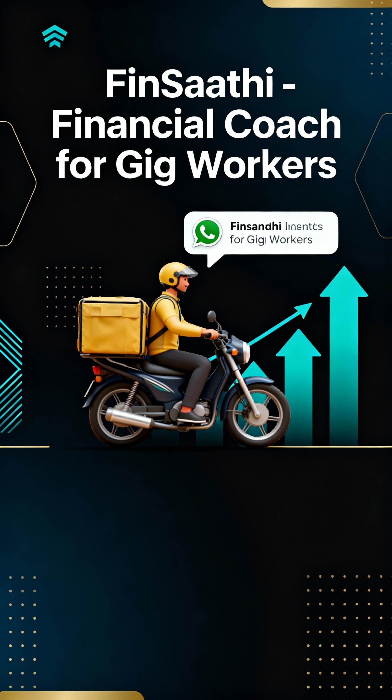

<div align="center">
  <br />
    <a href="https://github.com/Cyansiiii/mumbaihacks-Finsaathi" target="_blank">
      
    </a>
  <br />

  <div>
    
    
    
    
  </div>

  <h3 align="center">FinSaathi - Your Financial Companion for Gig Workers</h3>

   <div align="center">
     Empowering India's gig economy workforce with AI-powered financial solutions through WhatsApp
    </div>
</div>

## 📋 <a name="table">Table of Contents</a>

1. 🤖 [Introduction](#introduction)
2. ⚙️ [Tech Stack](#tech-stack)
3. 🔋 [Features](#features)
4. 🤸 [Quick Start](#quick-start)
5. 💡 [How It Works](#how-it-works)
6. 🎯 [Target Audience](#target-audience)
7. 🚀 [Future Roadmap](#roadmap)

## <a name="introduction">🤖 Introduction</a>

**FinSaathi** is a revolutionary financial platform designed specifically for India's gig economy workers. With over 7.7 million gig workers in India, there's a massive need for accessible, user-friendly financial services. FinSaathi bridges this gap by providing an AI-powered WhatsApp chatbot that helps gig workers manage their finances, access micro-loans, and achieve financial literacy.

Built for **MumbaiHacks 2025**, FinSaathi combines cutting-edge web technologies with a focus on financial inclusion and accessibility. The platform features a stunning, modern UI with smooth animations and an intuitive user experience.

### Why FinSaathi?

- 🎯 **Accessibility First**: WhatsApp-based chatbot accessible to anyone with a smartphone
- 💰 **Financial Inclusion**: Micro-loans and financial services tailored for gig workers
- 📱 **Simple Interface**: No complex banking apps - just chat naturally
- 🤖 **AI-Powered**: Intelligent chatbot that understands and responds in multiple languages
- 📊 **Financial Literacy**: Educational content to help workers make informed decisions

## <a name="tech-stack">⚙️ Tech Stack</a>

### Frontend
- **React.js** - Modern UI library for building interactive interfaces
- **Vite** - Next-generation frontend build tool for blazing-fast development
- **Tailwind CSS** - Utility-first CSS framework for custom designs
- **GSAP** - Professional-grade animation library for smooth interactions

### Additional Libraries
- **@gsap/react** - React wrapper for GSAP animations
- **clsx** - Utility for constructing className strings
- **react-icons** - Popular icon library
- **react-use** - Collection of essential React hooks

### AI & Backend (Chatbot)
- WhatsApp Business API Integration
- Natural Language Processing (NLP)
- Multi-language support

## <a name="features">🔋 Features</a>

### 🎨 **Modern UI/UX**
- Scroll-triggered animations using GSAP
- Smooth transitions and hover effects
- Fully responsive design across all devices
- Video storytelling elements
- Interactive components with 3D transformations

### 💬 **WhatsApp Chatbot Integration**
- Natural conversation interface
- 24/7 availability
- Multi-language support (Hindi, English, and regional languages)
- Quick response time
- Secure and encrypted communication

### 💳 **Financial Services**
- **Micro-Loans**: Quick approval process for small loans
- **Expense Tracking**: Monitor daily income and expenses
- **Savings Goals**: Set and track financial goals
- **Payment Reminders**: Never miss a payment deadline
- **Credit Score Building**: Help workers build creditworthiness

### 📚 **Financial Literacy**
- Educational content on money management
- Tips for saving and investing
- Understanding loans and interest rates
- Budgeting assistance
- Financial planning guidance

### 🔒 **Security & Privacy**
- End-to-end encryption
- Secure data storage
- Privacy-first approach
- Compliance with financial regulations

## <a name="quick-start">🤸 Quick Start</a>

Follow these steps to set up the project locally on your machine.

**Prerequisites**

Make sure you have the following installed on your machine:

- [Git](https://git-scm.com/)
- [Node.js](https://nodejs.org/en) (v18 or higher)
- [npm](https://www.npmjs.com/) (Node Package Manager)

**Cloning the Repository**

```bash
git clone https://github.com/Cyansiiii/mumbaihacks-Finsaathi.git
cd mumbaihacks2025
```

**Installation**

Install the project dependencies using npm:

```bash
npm install
```

**Running the Project**

```bash
npm run dev
```

Open [http://localhost:5173](http://localhost:5173) in your browser to view the project.

**Building for Production**

```bash
npm run build
```

**Preview Production Build**

```bash
npm run preview
```

## <a name="how-it-works">💡 How It Works</a>

### For Gig Workers:

1. **Connect on WhatsApp**: Save FinSaathi's number and send a "Hi"
2. **Choose Service**: Select from loans, expense tracking, or financial advice
3. **Provide Information**: Answer simple questions about your needs
4. **Get Instant Help**: Receive loan approvals, financial insights, or guidance
5. **Manage Finances**: Track repayments, expenses, and savings goals

### For Organizations:

FinSaathi can partner with:
- Gig economy platforms (ride-sharing, delivery services)
- Financial institutions looking to reach underserved markets
- NGOs focused on financial inclusion
- Government financial literacy programs

## <a name="target-audience">🎯 Target Audience</a>

### Primary Users
- 🛵 Delivery partners (Zomato, Swiggy, Dunzo)
- 🚗 Ride-sharing drivers (Ola, Uber)
- 🏠 Home service providers (Urban Company)
- 💼 Freelancers and independent contractors
- 📦 E-commerce logistics partners

### Demographics
- Age: 18-45 years
- Income: ₹10,000 - ₹50,000 per month
- Location: Tier 1, 2, and 3 cities across India
- Tech comfort: Basic smartphone users

## <a name="roadmap">🚀 Future Roadmap</a>

### Phase 1 (Current)
- ✅ WhatsApp chatbot integration
- ✅ Basic loan application system
- ✅ Expense tracking
- ✅ Multi-language support

### Phase 2
- 🔄 AI-powered credit scoring
- 🔄 Integration with UPI and digital wallets
- 🔄 Insurance products for gig workers
- 🔄 Investment options (mutual funds, SIPs)

### Phase 3
- 📋 Partnership with major gig platforms
- 📋 Advanced analytics dashboard
- 📋 Voice-based interactions
- 📋 Community features for peer support

### Phase 4
- 📋 Expansion to other emerging markets
- 📋 B2B solutions for enterprises
- 📋 Advanced AI for personalized financial planning
- 📋 Integration with government schemes

## 📊 Project Structure

```
mumbaihacks2025/
├── public/
│   ├── fonts/          # Custom fonts
│   ├── image/          # Images and graphics
│   └── videos/         # Video content and demos
├── src/
│   ├── components/     # React components
│   │   ├── About.jsx
│   │   ├── AnimatedTitle.jsx
│   │   ├── Button.jsx
│   │   ├── Contact.jsx
│   │   ├── Features.jsx
│   │   ├── Footer.jsx
│   │   ├── Hero.jsx
│   │   ├── Navbar.jsx
│   │   ├── Story.jsx
│   │   └── videopreview.jsx
│   ├── App.jsx        # Main app component
│   ├── index.css      # Global styles
│   └── main.jsx       # Entry point
├── .gitignore
├── eslint.config.js
├── index.html
├── package.json
├── postcss.config.js
├── README.md
├── tailwind.config.js
└── vite.config.js
```

## 🎥 Demo

Check out our WhatsApp chatbot in action:
- Video demonstrations available in `public/videos/`
- Live chatbot demo: [Contact us for access]

## 🤝 Contributing

We welcome contributions from the community! If you'd like to contribute:

1. Fork the repository
2. Create your feature branch (`git checkout -b feature/AmazingFeature`)
3. Commit your changes (`git commit -m 'Add some AmazingFeature'`)
4. Push to the branch (`git push origin feature/AmazingFeature`)
5. Open a Pull Request

## 📝 License

This project is created for **MumbaiHacks 2025** and is open for educational and development purposes.

## 👥 Team

Created with ❤️ by Team FinSaathi for MumbaiHacks 2025

## 📧 Contact

For queries, partnerships, or demo access:
- GitHub: [Cyansiiii](https://github.com/Cyansiiii)
- Repository: [mumbaihacks-Finsaathi](https://github.com/Cyansiiii/mumbaihacks-Finsaathi)

---

<div align="center">
  <strong>Empowering India's Gig Workers, One Chat at a Time</strong>
  <br />
  Made with 💙 for MumbaiHacks 2025
</div>
